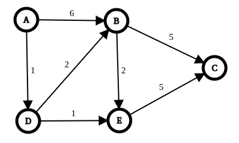
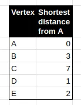
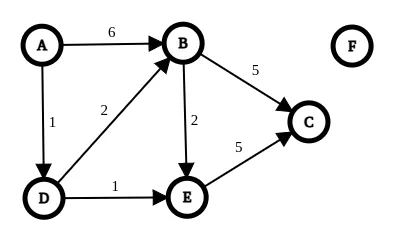

# dijkstra-algorithm

### Details

The Dijkstra algorithm is used to find the shortest paths in a weighted graph. In detail, given a graph where the arcs have a weight,
with this algorithm it’s possible to know, for each node, what the shortest path starting from a specific node is.

### Pseudo-code

Set distance of start vertex from itself to 0
Set distance of all other vertices from start = ∞ (infinity)
All vertices are unvisited

while there are unvisited vertices
  Set current vertex with the smallest known distance from the start vertex
  For the current vertex, examine its unvisited neighbours
    For the current neighboor, calculate distance of each neighbour from start vertex
    if the calculated distance is less than the known distance, update the shortest distance
  Current vertex is visited

iter 0

- A -> A = 0
- A -> B = 1000000
- A -> C = 1000000
- A -> D = 1000000
- A -> E = 1000000

iter 1
current = A
unvisited = B, C, D, E
visited = 

- A -> A = 0
- A -> B = 6
- A -> C = 1000000
- A -> D = 1
- A -> E = 1000000

iter 2
current = D
unvisited = B, C, E
visited = A

- A -> A = 0
- A -> B = 3
- A -> C = 1000000
- A -> D = 1
- A -> E = 2

iter 3
current = E
unvisited = B, C
visited = A, D

- A -> A = 0
- A -> B = 3
- A -> C = 7
- A -> D = 1
- A -> E = 2

iter 4
current = B
unvisited = C
visited = A, D, E

- A -> A = 0
- A -> B = 3
- A -> C = 7
- A -> D = 1
- A -> E = 2

iter 5
current = C
unvisited = 
visited = A, D, E, B

- A -> A = 0
- A -> B = 3
- A -> C = 7
- A -> D = 1
- A -> E = 2